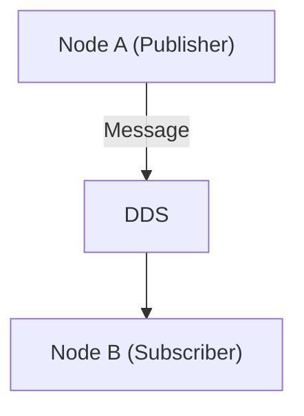

## Tutorial 1: Getting Started
### Part 1: Launch Your First Robot

**Duration:** 15 minutes

This section provides a brief introduction to what it's like to use ROS 2. We will launch a pre-built software stack using the "turtlebot" platform and demonstrate how the robot performs mapping in a simulation environment.

At the end of this tutorial, you would hopefully be able to build your own "turtlebot" simulator leveraging different ROS2 packages. 

#### 1.1. Make sure you Install All Necessary Packages.
```
sudo apt install ros-humble-navigation2 ros-humble-nav2-bringup

sudo apt install ros-humble-turtlebot3*
```
#### 1.2. Lauch the Robot in Simulator
```
ros2 launch turtlebot3_gazebo turtlebot3_world.launch.py
```
Open up a new terminal for the control keys.
```
ros2 run turtlebot3_teleop teleop_keyboard
```
Once you finish this, please do not close anything. Drive the robot around and wait for the others.

### Part 2: RVIZ and SLAM

**Duration:** 15 minutes

#### 2.1. Introduction
**2.1.1. RVIZ and Gazebo**

In robotic development, you will face a diverse range of data types, some include robot position frames, 2D lidar arrays, 3d point clouds and many more. 

<p align="center">
  
</p>


RViz is a powerful **3D visualization tool** in ROS that allows users to view and interact with complex robotic data in real time. It provides a graphical interface to visualize information such as sensor inputs (e.g., LiDAR, cameras), robot models, maps, and navigation paths. This helps developers and researchers better understand and debug the behavior of their robot systems by making abstract data intuitive and accessible.

**RVIZ vs Gazebo:** You may ask, if we already have RViz, why do we need Gazebo? Well, RViz is primarily a visualization tool—it shows you what the robot perceives, such as sensor data, map information, and planned paths. However, what the robot "sees" doesn't always reflect the actual dynamics of the real world. Gazebo, on the other hand, is a full-featured simulation environment that models the physical world. It can simulate physics, friction, collisions, and sensor noise, providing a more realistic and interactive testing ground for robotic algorithms before deploying them to real hardware.

**2.1.2. SLAM**

**Localization** determines the robot's position $(x, y, \theta)$ within a known map.

**Mapping** constructs a representation of the environment given known poses.

**SLAM** (Simultaneous Localization and Mapping) aims to estimate both the map $m$ and the robot's trajectory $x_{1:t}$ from sensor data $z_{1:t}$ and control inputs $u_{1:t}$, i.e.,

$$
p(x_{1:t}, m \mid z_{1:t}, u_{1:t})
$$


#### 2.2. Launch RVIZ and SLAM
To Launch your slam algorithm:
```
ros2 launch turtlebot3_cartographer cartographer.launch.py use_sim_time:=True
```

```diff
+ TODO1: After you have launched RVIZ, please drive the robot around the Simulated World to create your own map.

+ TODO2: Next, press "add" key on the bottom of the left hand panel to add a sensor of your choice.
```

### Part 3: Ros2 Basics

**Duration:** 30 minutes

#### 3.1. What is ROS2?

- ROS (Robot Operating System) is a flexible, modular middleware framework that enables communication, coordination, and control among components in a robotic system.
- ROS2 is very vauge and does not really relate to robot when first using it.
- Rather than giving you a cake you can add dressing on, ROS2 feels more like here is a cow, some wheat, go make a cake. 

#### 3.2. All Components in ROS2

| **ROS2 Concept**       | **Minecraft Analogy**                                                                | **Description**                                                                 |
|------------------------|---------------------------------------------------------------------------------------|----------------------------------------------------------------------------------|
| **Node**               | A player                                                         | Performs a specific task like moving, sensing, or reacting.                      |
| **Topic**              | A redstone signal line or chat channel that allows for communication between players                                            | Used for one-way communication between nodes.                                   |
| **Publisher**          | Dispenser or redstone clock                                                          | Sends out messages/data on a topic.                                              |
| **Subscriber**         | Pressure plate or observer block                                                     | Listens for and reacts to messages on a topic.                                   |
| **Message**            | Item, chat message, or redstone signal                                               | The actual data being passed between nodes.                                     |
| **Service**            | Command block with `/tp` or `/give`                                                  | Provides a request-response interaction.                                         |
| **Action**             | A sequence of commands (e.g., finding treasure)                                      | Long-running task that gives feedback and can be cancelled.                     |
| **Launch File**        | Setup script or command block chain                                                  | Spawns and connects multiple components at once.                                |
| **TF (Transform)**     | Coordinate system of each player or structure                                        | Tracks positions and orientations relative to each other.                       |
| **RVIZ**               | Minimap or map mod                                                                   | Visualizes positions, environment layout, and sensor data.                      |
| **Gazebo**             | Modded Minecraft world with physics (e.g., gravity tweaks, slime blocks)             | Simulates real-world physics and interactions.                                  |

```diff
+ TODO3: Try coming up with an analogy of your own?
```

#### 3.3. A Unified Framework
<div align="center">


</div>

1. **Node:** A chunk of code that is written by User which will perform a specific task or specific sequence of tasks. 

2. **Data Distribution Service:** This is a communication pipeline that is able to interface with all of our code. DDS allows for Nodes to communicate with each other using three main ways:
    - Publisher/Subscriber
    - Services
    - Actions


### Part 4: Build Your First ROS2 Package

**Duration:** 15 minutes
