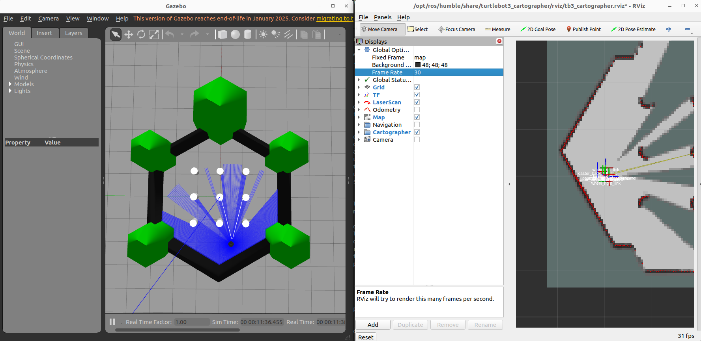
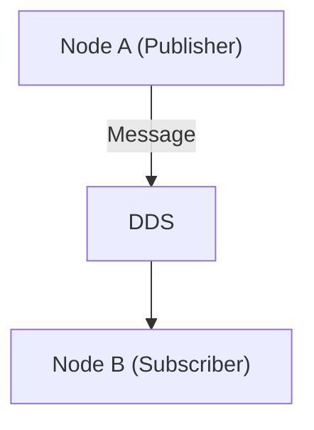

## Tutorial 1: Getting Started  
**Note:** Make sure you have all the pre-requisite packages from [here](https://github.com/Monash-Connected-Autonomous-Vehicle/ITS_Main_Vehicle/blob/main/README.md).  
### Part 1: Launch Your First Robot

**Duration:** 15 minutes  

This section provides a brief introduction to what it's like to use ROS 2. We will launch a pre-built software stack using the "turtlebot" platform and demonstrate how the robot performs mapping in a simulation environment.

At the end of this tutorial, you would hopefully be able to build your own "turtlebot" simulator leveraging different ROS2 packages. 

#### 1.1. Make sure you Install All Necessary Packages.
```
sudo apt install ros-humble-navigation2 ros-humble-nav2-bringup

sudo apt install ros-humble-turtlebot3*
```
#### 1.2. Lauch the Robot in Simulator
```
ros2 launch turtlebot3_gazebo turtlebot3_world.launch.py
```
Open up a new terminal for the control keys.
```
ros2 run turtlebot3_teleop teleop_keyboard
```
Once you finish this, please do not close anything. Drive the robot around and wait for the others.  

Note: When you first run the above command, it might takes a while to load up gazebo classic and spawn entity, just terminate the process and run again.  
It should says these after successfully run.
```
[spawn_entity.py-4] [INFO] [1756547822.329558688] [spawn_entity]: Spawn Entity started
[spawn_entity.py-4] [INFO] [1756547822.329964336] [spawn_entity]: Loading entity XML from file /opt/ros/humble/share/turtlebot3_gazebo/models/turtlebot3_waffle/model.sdf
[spawn_entity.py-4] [INFO] [1756547822.331031508] [spawn_entity]: Waiting for service /spawn_entity, timeout = 30
[spawn_entity.py-4] [INFO] [1756547822.331387593] [spawn_entity]: Waiting for service /spawn_entity
[spawn_entity.py-4] [INFO] [1756547823.336670634] [spawn_entity]: Calling service /spawn_entity
[gzserver-1] [INFO] [1756547823.494621331] [turtlebot3_imu]: <initial_orientation_as_reference> is unset, using default value of false to comply with REP 145 (world as orientation reference)
[spawn_entity.py-4] [INFO] [1756547823.655437076] [spawn_entity]: Spawn status: SpawnEntity: Successfully spawned entity [waffle]
```

### Part 2: RVIZ and SLAM

**Duration:** 15 minutes

#### 2.1. Introduction
**2.1.1. RVIZ and Gazebo**

In robotic development, you will face a diverse range of data types, some include robot position frames, 2D lidar arrays or camera images, 3D point clouds and many more. 

<p align="center">
  
</p>


RViz is a powerful **3D visualization tool** in ROS that allows users to view and interact with complex robotic data in real time. It provides a graphical interface to visualize information such as sensor inputs (e.g., LiDAR, cameras), robot models, maps, and navigation paths. This helps developers and researchers better understand and debug the behavior of their robot systems by making abstract data intuitive and accessible.

**RVIZ vs Gazebo:** You may ask, if we already have RViz, why do we need Gazebo? Well, RViz is primarily a visualization tool—it shows you what the robot perceives, such as sensor data, map information, and planned paths. However, what the robot "sees" may not fully reflect real world dynamics. Gazebo, on the other hand, is a full-featured simulation environment that models the physical world. It can simulate physics, friction, collisions, and sensor noise, providing a more realistic and interactive testing ground for robotic algorithms before deploying them to real hardware.

**2.1.2. SLAM**

**Localization** determines the robot's position $(x, y, \theta)$ within a known map.

**Mapping** constructs a representation of the environment given known robot poses.

**SLAM** (Simultaneous Localization and Mapping) aims to estimate both the map $m$ and the robot's trajectory $x_{1:t}$ from sensor data $z_{1:t}$ and control inputs $u_{1:t}$, i.e.,

$$
p(x_{1:t}, m \mid z_{1:t}, u_{1:t})
$$


#### 2.2. Launch RVIZ and SLAM
To Launch your slam algorithm:
```
ros2 launch turtlebot3_cartographer cartographer.launch.py use_sim_time:=True
```

```diff
+ TODO1: After you have launched RVIZ, please drive the robot around the Simulated World to create your own map.

+ TODO2: Next, press "add" key on the bottom of the left hand panel to add a sensor of your choice.
Hint: Make sure to select topic under the sensor e.g. /camera/image_raw
```

### Part 3: Ros2 Basics

**Duration:** 30 minutes

#### 3.1. What is ROS2?

- ROS (Robot Operating System) is a flexible, modular middleware framework that enables communication, coordination, and control among components in a robotic system.
- ROS2 is very vauge and does not really relate to robot when first using it.
- Instead of handing you a ready-made cake that you can simply decorate, ROS 2 is more like being given the raw ingredients: a cow for milk, wheat for flour—and being told to bake the cake yourself. 

#### 3.2. All Components in ROS2

| **ROS2 Concept**       | **Minecraft Analogy**                                                                | **Description**                                                                 |
|------------------------|---------------------------------------------------------------------------------------|----------------------------------------------------------------------------------|
| **Node**               | A player                                                         | A node is like an individual unit that performs one role, e.g., moving a robot arm, processing camera data, or planning a path.                      |
| **Topic**              | A redstone signal line or chat channel that allows for communication between players                                            | A communication channel where information flows in one direction. Multiple players (nodes) can send to or listen from it.                                   |
| **Publisher**          | Dispenser or redstone clock                                                          | Sends out messages/data on a topic.                                              |
| **Subscriber**         | Pressure plate or observer block                                                     | Listens for and reacts to messages on a topic.                                   |
| **Message**            | Item, chat message, or redstone signal                                               | The actual data being passed between nodes.                                     |
| **Service**            | Command block with `/tp` or `/give`                                                  | Provides a request-response interaction.                                         |
| **Action**             | A sequence of commands (e.g., finding treasure)                                      | Long-running task that gives feedback and can be cancelled.                     |
| **Launch File**        | Setup script or command block chain                                                  | A configuration that starts multiple nodes together with the right connections.                                |
| **TF (Transform)**     | Coordinate system of each player or structure                                        | Tracks positions and orientations relative to each other.                       |
| **RVIZ**               | Minimap or map mod                                                                   | Visualizes positions, environment layout, and sensor data.                      |
| **Gazebo**             | Modded Minecraft world with physics (e.g., gravity tweaks, slime blocks)             | Simulates real-world physics and interactions.                                  |

```diff
+ TODO3: Try coming up with an analogy of your own?
```

#### 3.3. A Unified Framework
<div align="center">


</div>

1. **Node:** A chunk of code that is written by User which will perform a specific task or specific sequence of tasks. 

2. **Data Distribution Service:** This is a communication pipeline that is able to interface with all of our code. DDS allows for Nodes to communicate with each other using three main ways:
    - Publisher/Subscriber
    - Services
    - Actions


### Part 4: Build Your First ROS2 Package

**Duration:** 15 minutes

#### 4.1. Converting Code into executable objects with Colcon Build:

**4.1.1. What is colcon?**

Colcon is the official build tool for ROS 2 that automates building, testing, and managing workspaces with multiple interdependent packages.

**4.1.2. What does colcon build do?**

`colcon build` is a command used in ROS 2 to compile all the packages inside your workspace's `src/` directory. It scans the source code, resolves dependencies, and builds each package in the correct order. The results are stored in the `build/`, `install/`, and `log/` directories. The `build/` folder contains temporary files used during compilation, `install/` holds the final executable and configuration files, and `log/` keeps logs from the build process. Running `colcon build` is an essential step that prepares your ROS 2 packages to be run or launched in a robot system.

```
colcon build --symlink-install
```
`--symlink-install` tells `colcon` to create symbolic links to your source files instead of copying them, allowing instant updates without rebuilding.

#### 4.2. ROS2 Workspace:
A ROS 2 workspace is a directory structure where you develop, build, and organize multiple ROS 2 packages together. 

The `src` folder in ros should be the only place that you put in your development code, you should not be needing to modify `build`, `install` or `log` folder.

A common thing to attempt when facing `catkin build` errors or other strange `build errors` is to delete the `build`, `install` and `log` folder and build again. 

```
ros2_ws/
├── src/           # Your code and imported package go here
│   ├── package 1/
│   └── package 2/
├── build/         # (autogenerated by `colcon build`)
├── install/       # (autogenerated by `colcon build`)
└── log/           # (autogenerated by `colcon build`)

```
```diff
+ TODO4: create a work space and source directory.
mkdir ${name}_ws
cd ${name}_ws
mkdir src
```
#### 4.3. ROS2 Package Structure:

You can choose to structure your ros2 package in a variety of different ways. Common templates are provided below:

**4.3.1. ROS2 C Package**

```
my_cpp_pkg/
├── CMakeLists.txt            # CMake build instructions
├── package.xml               # Package metadata
├── src/                      # C++ source files
│   └── my_node.cpp
├── include/                  # C++ header files
│   └── my_cpp_pkg/
│       └── my_node.hpp
└── launch/                   # (Optional) Launch files
    └── my_launch.py

```
You can create this package template using:
```
ros2 pkg create my_cpp_pkg --build-type ament_cmake --dependencies rclcpp
```

**4.3.2. ROS2 Python Package - Python Make**

```
my_python_pkg/
├── package.xml               # Package metadata
├── setup.py                  # Python build script
├── setup.cfg                 # (Optional) Build config
├── resource/
│   └── my_python_pkg         # Empty file for ROS 2 
├── my_python_pkg/            # Python module directory (must match package name)
│   ├── __init__.py
│   └── my_node.py
└── launch/                   # (Optional) Launch files
    └── my_launch.py

```
You can create this package template using:
```
ros2 pkg create my_python_pkg --build-type ament_python --dependencies rclpy
```


**4.3.3. ROS2 Python Package - cMake**
```
my_python_pkg/
├── package.xml               # Package metadata
├── CMakeLists.txt            # Uses ament_cmake to install Python scripts
├── resource/
│   └── my_python_pkg         # Required for ament indexing
├── my_python_pkg/            # Python package (must match name)
│   ├── __init__.py
│   └── my_node.py
└── launch/
    └── my_launch.py
```
You can create this package template using:
```
ros2 pkg create my_cmake_python_pkg --build-type ament_cmake --dependencies rclpy
```


#### 4.4. Create Your First Package:
Please do not be intimidated by the level of complexity above, in this course you will be writing a very minimal amount of code. 

While different developers have different package preferences, in this tutorial we will be using the template of `python_ament_cmake`, as doing so would allow us to incooporate both `python` and `c` code in the same package. Giving us a bit more diversity and making it more user-friendly for everyone.

1. Please create your own package and assign a package name to your robot. **Please make sure you are inside your `src` repository.**

```
ros2 pkg create [package_name] --build-type ament_cmake --dependencies rclpy
```

2. Add a launch folder into your package
```
cd [package_name] 
```
```
mkdir launch
```

3. Build your empty package in your main Workspace. Navigate back using the command below.

```
cd ..
```

4. Now source and visualize your package.
```
source install/setup.bash
```
```
ros2 pkg list
```

### Homework:

**Duration:** 20 minutes

```diff
+ TODO5: Can you now try to create a publisher and subscriber of your own please? 

+ TODO6: Visualize your topics using `ros2 topic list`
```
Use the reference link to help you: https://docs.ros.org/en/humble/Tutorials/Beginner-Client-Libraries/Writing-A-Simple-Py-Publisher-And-Subscriber.html
