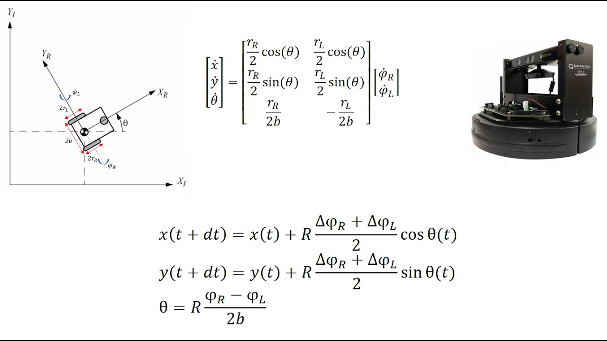

## Tutorial 2: Build Your Robot

The goal of this project is to connect your project to gazebo and build an urdf of your robot.

### Part 1: Install Gazebo:
#### 1.1. How to Install:

1. Follow the guide below to install Gazebo Ignition

**Gazebo Ignition Fortress install**: https://gazebosim.org/docs/fortress/install_ubuntu/

2. Follow the guide below to install Ros-Gazebo Pairing

**ROS2 Gazebo Bridge**: https://gazebosim.org/docs/fortress/ros_installation/

#### 1.2. Benefits and Disadvantage of New Gazebo:


**✅ Top 3 Benefits**

1. **Modular Architecture**  
   Clean separation of physics, rendering, sensors, and GUI makes it extensible and scalable.

2. **High-Fidelity Simulation**  
   Supports multiple physics engines and GPU-based sensors with realistic rendering (PBR).

3. **ROS 2 Integration**  
   Native support for ROS 2 via official bridge enables seamless use in robotic systems.

---

**❌ Top 3 Disadvantages**

1. **Steep Learning Curve**  
   More complex setup and unfamiliar ECS model can be challenging for new users.

2. **Incomplete Ecosystem**  
   Many classic Gazebo plugins/tools haven't been ported; feature gaps still exist.

3. **Fragmented Documentation**  
   Documentation is scattered across multiple sources and lacks consistency.


### Part 2: Set up your project:

**1. Get into the package you created in the last tutorial:**

```
cd [package_name] 
```
**2. Create a set of `Folders` which do not exist in your current repo.**
```
mkdir -p config description launch rviz worlds
```
**3. Change your `[package_name]` and replace the code inside the `CMakeLists.txt` with the following code:**
- this `CMakeLists.txt` is an essential component of ROS2, it is a configuration file used by CMake, a build system generator. It tells CMake how to build and organize your project:

```cmake
cmake_minimum_required(VERSION 3.5)
project([package_name]) #<-- Change ME!!!!

# Default to C99
if(NOT CMAKE_C_STANDARD)
  set(CMAKE_C_STANDARD 99)
endif()

# Default to C++14
if(NOT CMAKE_CXX_STANDARD)
  set(CMAKE_CXX_STANDARD 14)
endif()

if(CMAKE_COMPILER_IS_GNUCXX OR CMAKE_CXX_COMPILER_ID MATCHES "Clang")
  add_compile_options(-Wall -Wextra -Wpedantic)
endif()

# find dependencies
find_package(ament_cmake REQUIRED)
# uncomment the following section in order to fill in
# further dependencies manually.
# find_package(<dependency> REQUIRED)

if(BUILD_TESTING)
  find_package(ament_lint_auto REQUIRED)
  # the following line skips the linter which checks for copyrights
  # uncomment the line when a copyright and license is not present in all source files
  #set(ament_cmake_copyright_FOUND TRUE)
  # the following line skips cpplint (only works in a git repo)
  # uncomment the line when this package is not in a git repo
  #set(ament_cmake_cpplint_FOUND TRUE)
  ament_lint_auto_find_test_dependencies()
endif()

install(
  DIRECTORY config description launch worlds
  DESTINATION share/${PROJECT_NAME}
)

ament_package()
```

**4. Add the following gazebo dependencies to the `package.xml` file:**

```xml
<depend>geometry_msgs</depend>
<depend>nav_msgs</depend>
<depend>rclcpp</depend>
<depend>ros_gz_bridge</depend>
<depend>ros_gz_image</depend>
<depend>ros_gz_sim</depend>
<depend>sensor_msgs</depend>
<depend>tf2</depend>
```

### Part 3 Building Your Virtual Robot:
#### 3.1. What is a Differential Robot?
<p align="center">
  
</p>

A **differential drive robot** is a mobile robot with two independently controlled wheels on either side of the chassis. It moves by varying the speed and direction of these wheels.

- **Forward**: both wheels move at the same speed  
- **Turning**: wheels move at different speeds or in opposite directions

Example Differential Robots: Penguin PI, TurtleBot, Asterius Mk3

#### 3.2. How do ROS2 understand your robot?

ROS2 understands the structure of your robot using the **Unified Robot Description Format (URDF)**. A URDF is an XML-based format used to describe a robot's physical configuration, including its links (rigid bodies), joints (connections), dimensions, and optional properties like mass, inertia, and visuals. It acts as a blueprint for how different parts of your robot are connected and move relative to each other.

This description is essential for simulation, visualization (e.g., in RViz), and computing kinematics. In ROS2, tools like `robot_state_publisher` use the URDF to publish real-time transformations between frames, and `joint_state_publisher` or simulation environments like Gazebo use it to animate or simulate your robot's behavior. The URDF can be written directly or generated dynamically using **xacro**, which allows for macros and parameters to avoid repetitive code.

For more clear explanation of this concept please review: 
- https://www.youtube.com/watch?v=CwdbsvcpOHM&t=1447s
- https://www.youtube.com/watch?v=BcjHyhV0kIs&t=294s

Now Let's get started:

1. Create a file called `rsp.launch.py` in your `launch` folder, paste the following code into the folder, make sure you change `[your package name]`:
```python
from launch import LaunchDescription
from launch.actions import DeclareLaunchArgument
from launch.substitutions import LaunchConfiguration, Command
from launch_ros.actions import Node
from ament_index_python.packages import get_package_share_directory
import os

def generate_launch_description():
    # Use sim time argument
    use_sim_time = LaunchConfiguration('use_sim_time')

    # Path to your package and robot description
    pkg_path = os.path.join(get_package_share_directory('[your package name]'))  # <--- CHANGE ME
    xacro_file = os.path.join(pkg_path, 'description', 'robot.urdf.xacro')

    # Generate robot description from xacro
    robot_description_config = Command(['xacro ', xacro_file, ' sim_mode:=', use_sim_time])
    params = {'robot_description': robot_description_config, 'use_sim_time': use_sim_time}

    # Node to publish robot state
    node_robot_state_publisher = Node(
        package='robot_state_publisher',
        executable='robot_state_publisher',
        output='screen',
        parameters=[params]
    )

    # Launch
    return LaunchDescription([
        DeclareLaunchArgument(
            'use_sim_time',
            default_value='true',
            description='Use simulation time if true'
        ),
        node_robot_state_publisher
    ])

```
---
2. Now in the `description` folder create a new file called `robot.urdf.xacro` and paste the following into the file, I will provide you with some additional files for you to put in the same folder:
```xml
<?xml version="1.0"?>
<robot xmlns:xacro="http://www.ros.org/wiki/xacro"  name="robot">
    <xacro:arg name="use_ros2_control" default="true"/>
    <xacro:arg name="sim_mode" default="false"/>
    <xacro:include filename="robot_core_4wd.xacro" />
</robot>

```
---
3. Now Let us try understand our robot description file:

**Parameters and Macros**
- `xacro:include` includes reusable macros (e.g., for inertial calculations).
- `xacro:property` defines physical and visual properties:
  - Dimensions: `chassis_length`, `wheel_radius`, etc.
  - Masses: `chassis_mass`, `wheel_mass`, etc.
  - Positions: wheel and caster offsets.

**Materials**
- Defines custom colors for parts using `<material>`:
  - `white`, `orange`, `blue`, `black`, `red`
- Used for visualization in RViz and Gazebo.

**Base and Coordinate Frames**
- `base_link`: Central reference frame of the robot.
- `base_footprint`: Flat frame on the ground; useful for navigation.
  - Connected to `base_link` using a fixed joint.

**Chassis**
- Represents the main body of the robot.
- Link name: `chassis`
- Includes:
  - `visual`: a colored box
  - `collision`: same geometry as visual
  - `inertial`: mass and inertia defined using `xacro:inertial_box`
- Attached to `base_link` with a fixed joint and positioned using `origin`.

**Wheels (4 in Total)**
Each wheel (left/right, front/back) has:
- A continuous joint allowing rotation around the z-axis.
- A link that includes:
  - `visual`: a cylinder for appearance
  - `collision`: simplified as a sphere
  - `inertial`: properties defined with `xacro:inertial_cylinder`
- Correctly positioned relative to the base using `origin`.

Wheel link and joint names:
- `left_front_wheel`, `left_back_wheel`
- `right_front_wheel`, `right_back_wheel`

**Gazebo Tags**
- `<gazebo reference="...">` sets simulation-specific properties.
- Assigns materials for visual appearance in the Gazebo simulator.
---

4. Now go back to your main directory, build and launch your package:
```
colcon build 
```
```
source install/setup.bash
```
```
ros2 launch [your_package_name] rsp.launch.py
```
5. Open up a new terminal and launch
```
ros2 run joint_state_publisher_gui joint_state_publisher_gui
```
