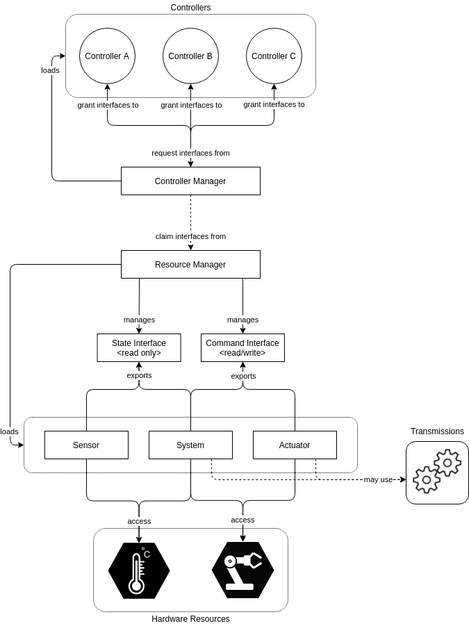

## Tutorial 3: ROS2 Control

<p align="center">
  
</p>

ROS2 Control is a modular framework in the Robot Operating System (ROS 2) ecosystem designed to manage and abstract hardware interfaces for controlling robot actuators. It provides a standardized interface between the control logic and hardware, enabling easier integration of various controllers, real-time execution, and hardware-agnostic development. By separating controller logic from robot-specific implementations, ROS2 Control promotes reusable, scalable, and maintainable robotic software systems.

### Advantages
- ✅ **Modular and extensible** architecture allows for plug-and-play controller integration.
- ✅ **Standardized interfaces** promote hardware abstraction and code reuse.
- ✅ **Real-time capability** through integration with real-time executors and middleware.
- ✅ **Community support** and active development with ROS 2 ecosystem compatibility.
- ✅ **Simulation support** via Gazebo and Ignition for testing without hardware.

### Disadvantages
- ❌ **Steep learning curve** for beginners unfamiliar with controllers and hardware interfaces.
- ❌ **Limited official documentation** for some advanced features or hardware.
- ❌ **Compatibility issues** may arise with non-standard or legacy hardware.
- ❌ **Real-time performance** requires careful setup and tuning, not guaranteed by default.
- ❌ **Debugging complexity** due to layered architecture and dynamic loading of components.

```diff
+ TODO1: How will you develope a diff drive controller if you are doing it yourselves? 
```

### Install the Dependencies

Since we will be controlling the robot inside of a simulated environment, we need to install a set of packages that can help us with this task:
```
sudo apt update
sudo apt install ros-humble-teleop-twist-keyboard
sudo apt install ros-humble-ros2-control ros-humble-ros2-controllers
sudo apt install ros-humble-gz-ros2-control ros-humble-gz-ros2-control-demos
```

### 3.1. Define Controller Files
Define your Ros2 Control System by creating a `yaml` file called `my_controllers_4wd.yaml` in the `config` folder, paste inside the file the following:
```yaml
controller_manager:
  ros__parameters:
    update_rate: 100  # Hz

    joint_state_broadcaster:
      type: joint_state_broadcaster/JointStateBroadcaster

    diff_drive_base_controller:
      type: diff_drive_controller/DiffDriveController
```

#### Parameters:
- **update_rate**:  
  Defines how frequently (in Hz) the controller manager updates all active controllers.  
  `100` means updates occur every 10 ms.

- **joint_state_broadcaster**:  
  Loads a controller of type `JointStateBroadcaster`, which publishes the current state (position, velocity, effort) of all robot joints.

- **diff_drive_base_controller**:  
  Loads the differential drive controller responsible for managing a mobile base with two independently driven wheels.

---

Now let us define the `diff_drive_base_controller`

```yaml
diff_drive_base_controller:
  ros__parameters:
    left_wheel_names: ["left_wheel_joint"]
    right_wheel_names: ["right_wheel_joint"]

    wheel_separation: 1.25
    #wheels_per_side: 1  # actually 2, but both are controlled by 1 signal
    wheel_radius: 0.3

    wheel_separation_multiplier: 1.0
    left_wheel_radius_multiplier: 1.0
    right_wheel_radius_multiplier: 1.0

    publish_rate: 50.0
    odom_frame_id: odom
    base_frame_id: base_link
    pose_covariance_diagonal : [0.001, 0.001, 0.0, 0.0, 0.0, 0.01]
    twist_covariance_diagonal: [0.001, 0.0, 0.0, 0.0, 0.0, 0.01]

    open_loop: false
    enable_odom_tf: true

    cmd_vel_timeout: 0.5
    #publish_limited_velocity: true
    use_stamped_vel: false
    #velocity_rolling_window_size: 10

    # Velocity and acceleration limits
    # Whenever a min_* is unspecified, default to -max_*
    linear.x.has_velocity_limits: true
    linear.x.has_acceleration_limits: true
    linear.x.has_jerk_limits: false
    linear.x.max_velocity: 1.0
    linear.x.min_velocity: -1.0
    linear.x.max_acceleration: 1.0
    linear.x.max_jerk: 0.0
    linear.x.min_jerk: 0.0

    angular.z.has_velocity_limits: true
    angular.z.has_acceleration_limits: true
    angular.z.has_jerk_limits: false
    angular.z.max_velocity: 1.0
    angular.z.min_velocity: -1.0
    angular.z.max_acceleration: 1.0
    angular.z.min_acceleration: -1.0
    angular.z.max_jerk: 0.0
    angular.z.min_jerk: 0.0
```

#### Parameters:
- **left_wheel_names**:  
  Specifies the name(s) of the joints controlling the left wheels.  
  Example: `["left_wheel_joint"]`.

- **right_wheel_names**:  
  Specifies the name(s) of the joints controlling the right wheels.  
  Example: `["right_wheel_joint"]`.

- **wheel_separation**:  
  The lateral distance between the centers of the left and right wheels, in meters.  
  Example: `1.25`.

- **wheel_radius**:  
  Radius of the wheels, in meters.  
  Example: `0.3`.

- **wheel_separation_multiplier**:  
  Scaling factor applied to the `wheel_separation`. Useful for fine-tuning the controller behavior.  
  Default: `1.0` (no scaling).

- **left_wheel_radius_multiplier / right_wheel_radius_multiplier**:  
  Scaling factors applied to the respective wheel radii for calibration or tuning.

- **publish_rate**:  
  Rate at which the controller publishes odometry and other state information, in Hz.  
  Example: `50.0` Hz.

- **odom_frame_id**:  
  Name of the coordinate frame used for the odometry output.  
  Example: `"odom"`.

- **base_frame_id**:  
  Name of the coordinate frame attached to the robot base.  
  Example: `"base_link"`.

---

### 3.2. Describe your controller-interface

Create a controller-interface by creating a `xacro` file called `ros2_control_4wd.xacro` in the `description` folder, paste inside the file the following:

```xml

<?xml version="1.0"?>
<robot xmlns:xacro="http://www.ros.org/wiki/xacro">

  <xacro:arg name="namespace" default="" />
  <xacro:arg name="sim_mode" default="false" />
  <xacro:unless value="$(arg sim_mode)">
    <ros2_control name="RealRobot" type="system">
      <hardware>
        <plugin>diffdrive_arduino/DiffDriveArduinoHardware</plugin>
        <param name="left_wheel_name">left_wheel_joint</param>
        <param name="right_wheel_name">right_wheel_joint</param>
        <param name="loop_rate">30</param>
        <param name="device">/dev/ttyACM0</param>
        <param name="baud_rate">57600</param>
        <param name="timeout">1000</param>
        <param name="open_loop">true</param>
        <!--<param name="enc_counts_per_rev">1</param>-->
      </hardware>
      <joint name="left_front_wheel_joint">
        <command_interface name="velocity">
          <param name="min">-10</param>
          <param name="max">10</param>
        </command_interface>
        <state_interface name="position"/> 
        <state_interface name="velocity"/>
      </joint>
      <joint name="left_back_wheel_joint">
        <command_interface name="velocity">
          <param name="min">-10</param>
          <param name="max">10</param>
        </command_interface>
        <state_interface name="position"/>
        <state_interface name="velocity"/>  
      </joint>
      <joint name="right_front_wheel_joint">
        <command_interface name="velocity">
          <param name="min">-10</param>
          <param name="max">10</param>
        </command_interface>
        <state_interface name="position"/> 
        <state_interface name="velocity"/>
      </joint>
      <joint name="right_back_wheel_joint">
        <command_interface name="velocity">
          <param name="min">-10</param>
          <param name="max">10</param>
        </command_interface>
        <state_interface name="position"/>
        <state_interface name="velocity"/>  
      </joint>
    </ros2_control>
  </xacro:unless>

  <xacro:if value="$(arg sim_mode)">
    <ros2_control name="GazeboSimSystem" type="system">
      <hardware>
        <plugin>gz_ros2_control/GazeboSimSystem</plugin>
      </hardware>
      <joint name="left_front_wheel_joint">
        <command_interface name="velocity">
          <param name="min">-10</param>
          <param name="max">10</param>
        </command_interface>
        <state_interface name="velocity" />
        <state_interface name="position" />
      </joint>
      <joint name="left_back_wheel_joint">
        <command_interface name="velocity">
          <param name="min">-10</param>
          <param name="max">10</param>
        </command_interface>
        <state_interface name="velocity" />
        <state_interface name="position" />
      </joint>
      <joint name="right_front_wheel_joint">
        <command_interface name="velocity">
          <param name="min">-10</param>
          <param name="max">10</param>
        </command_interface>
        <state_interface name="velocity" />
        <state_interface name="position" />
      </joint>
      <joint name="right_back_wheel_joint">
        <command_interface name="velocity">
          <param name="min">-10</param>
          <param name="max">10</param>
        </command_interface>
        <state_interface name="velocity" />
        <state_interface name="position" />
      </joint>
    </ros2_control>
  </xacro:if>

  <gazebo>
    <plugin filename="gz_ros2_control-system" name="gz_ros2_control::GazeboSimROS2ControlPlugin">
      <ros>
        <namespace>$(arg namespace)</namespace>
      </ros>
      <parameters>$(find [package_name])/config/my_controllers_4wd.yaml</parameters>
      <parameters>$(find [package_name])/config/gaz_ros2_ctl_use_sim.yaml</parameters>
    </plugin>
  </gazebo>

</robot>
```

- In a real robot we will have an actual actuation controller like a `ESP32` or an `Arduino Nano` responsible for controlling the system. 1ROS21 need to communicate with this controller to give command to it or receive information from it. 
- We need to write our own **hardware interface** when working with an actual robot, however for this case, we just need to describe how it interacts with the simulated hardware interface generated by Gazebo. 

### 3.3. Creating Gazebo World
In new Gazebo Ignition, you will have to define the world you want to create, please copy and paste the following into a file called `sim_word.sdf` in the worlds folder: 

```xml
<?xml version="1.0" ?>
<sdf version="1.8">
  <world name="world_demo">
    <physics name="1ms" type="sdformat">
      <max_step_size>0.001</max_step_size>
      <real_time_factor>1.0</real_time_factor>
    </physics>
    <plugin
      filename="libignition-gazebo-physics-system.so"
      name="ignition::gazebo::systems::Physics">
    </plugin>
    <plugin
      filename="libignition-gazebo-user-commands-system.so"
      name="ignition::gazebo::systems::UserCommands">
    </plugin>
    <plugin
      filename="libignition-gazebo-scene-broadcaster-system.so"
      name="ignition::gazebo::systems::SceneBroadcaster">
    </plugin>
    <!--LiDAR -->
    <plugin
      filename="libignition-gazebo-sensors-system.so"
      name="ignition::gazebo::systems::Sensors">
      <render_engine>ogre2</render_engine>
    </plugin>
    <!--light-->
    <light type="directional" name="sun">
      <cast_shadows>true</cast_shadows>
      <pose>0 0 10 0 0 0</pose>
      <diffuse>0.8 0.8 0.8 1</diffuse>
      <specular>0.2 0.2 0.2 1</specular>
      <attenuation>
        <range>1000</range>
        <constant>0.9</constant>
        <linear>0.01</linear>
        <quadratic>0.001</quadratic>
      </attenuation>
      <direction>-0.5 0.1 -0.9</direction>
    </light>

    

    <model name="ground_plane">
            <static>true</static>
            <link name="link">
                <collision name="collision">
                <geometry>
                    <plane>
                    <normal>0 0 1</normal>
                    </plane>
                </geometry>
                </collision>
                <visual name="visual">
                <geometry>
                    <plane>
                    <normal>0 0 1</normal>
                    <size>100 100</size>
                    </plane>
                </geometry>
                <material>
                    <ambient>0.8 0.8 0.8 1</ambient>
                    <diffuse>0.8 0.8 0.8 1</diffuse>
                    <specular>0.8 0.8 0.8 1</specular>
                </material>
                </visual>
            </link>
    </model>

    <!-- Box at (1, 0) -->
        <!-- row 0 -->
    <model name="cube_0_0"><pose>-5.0 -5.0 0.15 0 0 0</pose><link name="link"><collision name="collision"><geometry><box><size>0.5 0.5 0.5</size></box></geometry></collision><visual name="visual"><geometry><box><size>0.5 0.5 0.5</size></box></geometry></visual></link></model>
    <model name="cube_0_1"><pose>-5.0 -2.5 0.15 0 0 0</pose><link name="link"><collision name="collision"><geometry><box><size>0.5 0.5 0.5</size></box></geometry></collision><visual name="visual"><geometry><box><size>0.5 0.5 0.5</size></box></geometry></visual></link></model>
    <model name="cube_0_2"><pose>-5.0 0.0 0.15 0 0 0</pose><link name="link"><collision name="collision"><geometry><box><size>0.5 0.5 0.5</size></box></geometry></collision><visual name="visual"><geometry><box><size>0.5 0.5 0.5</size></box></geometry></visual></link></model>
    <model name="cube_0_3"><pose>-5.0 2.5 0.15 0 0 0</pose><link name="link"><collision name="collision"><geometry><box><size>0.5 0.5 0.5</size></box></geometry></collision><visual name="visual"><geometry><box><size>0.5 0.5 0.5</size></box></geometry></visual></link></model>
    <model name="cube_0_4"><pose>-5.0 5.0 0.15 0 0 0</pose><link name="link"><collision name="collision"><geometry><box><size>0.5 0.5 0.5</size></box></geometry></collision><visual name="visual"><geometry><box><size>0.5 0.5 0.5</size></box></geometry></visual></link></model>

    <model name="cube_1_0"><pose>-2.5 -5.0 0.15 0 0 0</pose><link name="link"><collision name="collision"><geometry><box><size>0.3 0.3 0.3</size></box></geometry></collision><visual name="visual"><geometry><box><size>0.5 0.5 0.5</size></box></geometry></visual></link></model>
    <model name="cube_1_1"><pose>-2.5 -2.5 0.15 0 0 0</pose><link name="link"><collision name="collision"><geometry><box><size>0.3 0.3 0.3</size></box></geometry></collision><visual name="visual"><geometry><box><size>0.5 0.5 0.5</size></box></geometry></visual></link></model>
    <model name="cube_1_2"><pose>-2.5 0.0 0.15 0 0 0</pose><link name="link"><collision name="collision"><geometry><box><size>0.3 0.3 0.3</size></box></geometry></collision><visual name="visual"><geometry><box><size>0.5 0.5 0.5</size></box></geometry></visual></link></model>
    <model name="cube_1_3"><pose>-2.5 2.5 0.15 0 0 0</pose><link name="link"><collision name="collision"><geometry><box><size>0.3 0.3 0.3</size></box></geometry></collision><visual name="visual"><geometry><box><size>0.5 0.5 0.5</size></box></geometry></visual></link></model>
    <model name="cube_1_4"><pose>-2.5 5.0 0.15 0 0 0</pose><link name="link"><collision name="collision"><geometry><box><size>0.3 0.3 0.3</size></box></geometry></collision><visual name="visual"><geometry><box><size>0.5 0.5 0.5</size></box></geometry></visual></link></model>

    <model name="cube_2_0"><pose>0.0 -5.0 0.15 0 0 0</pose><link name="link"><collision name="collision"><geometry><box><size>0.3 0.3 0.3</size></box></geometry></collision><visual name="visual"><geometry><box><size>0.5 0.5 0.5</size></box></geometry></visual></link></model>
    <model name="cube_2_1"><pose>0.0 -2.5 0.15 0 0 0</pose><link name="link"><collision name="collision"><geometry><box><size>0.3 0.3 0.3</size></box></geometry></collision><visual name="visual"><geometry><box><size>0.5 0.5 0.5</size></box></geometry></visual></link></model>
    <!--<model name="cube_2_2"><pose>0.0 0.0 0.15 0 0 0</pose><link name="link"><collision name="collision"><geometry><box><size>0.3 0.3 0.3</size></box></geometry></collision><visual name="visual"><geometry><box><size>0.3 0.3 0.3</size></box></geometry></visual></link></model>-->
    <model name="cube_2_3"><pose>0.0 2.5 0.15 0 0 0</pose><link name="link"><collision name="collision"><geometry><box><size>0.3 0.3 0.3</size></box></geometry></collision><visual name="visual"><geometry><box><size>0.5 0.5 0.5</size></box></geometry></visual></link></model>
    <model name="cube_2_4"><pose>0.0 5.0 0.15 0 0 0</pose><link name="link"><collision name="collision"><geometry><box><size>0.3 0.3 0.3</size></box></geometry></collision><visual name="visual"><geometry><box><size>0.5 0.5 0.5</size></box></geometry></visual></link></model>

    <model name="cube_3_0"><pose>2.5 -5.0 0.15 0 0 0</pose><link name="link"><collision name="collision"><geometry><box><size>0.3 0.3 0.3</size></box></geometry></collision><visual name="visual"><geometry><box><size>0.5 0.5 0.5</size></box></geometry></visual></link></model>
    <model name="cube_3_1"><pose>2.5 -2.5 0.15 0 0 0</pose><link name="link"><collision name="collision"><geometry><box><size>0.3 0.3 0.3</size></box></geometry></collision><visual name="visual"><geometry><box><size>0.5 0.5 0.5</size></box></geometry></visual></link></model>
    <model name="cube_3_2"><pose>2.5 0.0 0.15 0 0 0</pose><link name="link"><collision name="collision"><geometry><box><size>0.3 0.3 0.3</size></box></geometry></collision><visual name="visual"><geometry><box><size>0.5 0.5 0.5</size></box></geometry></visual></link></model>
    <model name="cube_3_3"><pose>2.5 2.5 0.15 0 0 0</pose><link name="link"><collision name="collision"><geometry><box><size>0.3 0.3 0.3</size></box></geometry></collision><visual name="visual"><geometry><box><size>0.5 0.5 0.5</size></box></geometry></visual></link></model>
    <model name="cube_3_4"><pose>2.5 5.0 0.15 0 0 0</pose><link name="link"><collision name="collision"><geometry><box><size>0.3 0.3 0.3</size></box></geometry></collision><visual name="visual"><geometry><box><size>0.5 0.5 0.5</size></box></geometry></visual></link></model>

    <model name="cube_4_0"><pose>5.0 -5.0 0.15 0 0 0</pose><link name="link"><collision name="collision"><geometry><box><size>0.3 0.3 0.3</size></box></geometry></collision><visual name="visual"><geometry><box><size>0.5 0.5 0.5</size></box></geometry></visual></link></model>
    <model name="cube_4_1"><pose>5.0 -2.5 0.15 0 0 0</pose><link name="link"><collision name="collision"><geometry><box><size>0.3 0.3 0.3</size></box></geometry></collision><visual name="visual"><geometry><box><size>0.5 0.5 0.5</size></box></geometry></visual></link></model>
    <model name="cube_4_2"><pose>5.0 0.0 0.15 0 0 0</pose><link name="link"><collision name="collision"><geometry><box><size>0.3 0.3 0.3</size></box></geometry></collision><visual name="visual"><geometry><box><size>0.5 0.5 0.5</size></box></geometry></visual></link></model>
    <model name="cube_4_3"><pose>5.0 2.5 0.15 0 0 0</pose><link name="link"><collision name="collision"><geometry><box><size>0.3 0.3 0.3</size></box></geometry></collision><visual name="visual"><geometry><box><size>0.5 0.5 0.5</size></box></geometry></visual></link></model>
    <model name="cube_4_4"><pose>5.0 5.0 0.15 0 0 0</pose><link name="link"><collision name="collision"><geometry><box><size>0.3 0.3 0.3</size></box></geometry></collision><visual name="visual"><geometry><box><size>0.5 0.5 0.5</size></box></geometry></visual></link></model>

    </world>
</sdf>
```
To read more about this please visit: https://gazebosim.org/docs/fortress/sdf_worlds/

### 3.4. Spawn The Robot

Since we have added in the ros2 control module we have to modify the `robot.urdf.xacro` to incoorporate consideration for Ros2 Control: 

```xml
<?xml version="1.0"?>
<robot xmlns:xacro="http://www.ros.org/wiki/xacro"  name="robot">
    <xacro:arg name="use_ros2_control" default="true"/>
    <xacro:arg name="sim_mode" default="false"/>
    <xacro:include filename="robot_core_4wd.xacro" />
    <xacro:if value="$(arg use_ros2_control)">
        <xacro:include filename="ros2_control_4wd.xacro" />
    </xacro:if>
</robot>

```

We will also have to modify the `launch/rsp.launch.py` accordingly. 
```python
import os

from ament_index_python.packages import get_package_share_directory

from launch import LaunchDescription
from launch.substitutions import LaunchConfiguration, Command
from launch.actions import DeclareLaunchArgument
from launch_ros.actions import Node

import xacro


def generate_launch_description():

    # Check if we're told to use sim time
    use_sim_time = LaunchConfiguration('use_sim_time')
    use_ros2_control = LaunchConfiguration('use_ros2_control')

    # Process the URDF file
    pkg_path = os.path.join(get_package_share_directory('package_name')) <- # CHANGE ME!!!!
    xacro_file = os.path.join(pkg_path,'description','robot.urdf.xacro')
    # robot_description_config = xacro.process_file(xacro_file).toxml()
    robot_description_config = Command(['xacro ', xacro_file, ' use_ros2_control:=', use_ros2_control, ' sim_mode:=', use_sim_time])
    
    # Create a robot_state_publisher node
    params = {'robot_description': robot_description_config, 'use_sim_time': use_sim_time}
    node_robot_state_publisher = Node(
        package='robot_state_publisher',
        executable='robot_state_publisher',
        output='screen',
        parameters=[params]
    )


    # Launch!
    return LaunchDescription([
        DeclareLaunchArgument(
            'use_sim_time',
            default_value='false',
            description='Use sim time if true'),
        DeclareLaunchArgument(
            'use_ros2_control',
            default_value='true',
            description='Use ros2_control if true'),

        node_robot_state_publisher
    ])
```
We will also need to create a new file called `launch/launch_sim.launch.py`.

```python
import os
from ament_index_python.packages import get_package_share_directory
from launch import LaunchDescription
from launch.actions import DeclareLaunchArgument, IncludeLaunchDescription
from launch.launch_description_sources import PythonLaunchDescriptionSource
from launch.substitutions import LaunchConfiguration, PathJoinSubstitution
from launch_ros.actions import Node
from launch_ros.substitutions import FindPackageShare

def generate_launch_description():    

    # Define the input parameters
    use_sim_time     = LaunchConfiguration('use_sim_time', default='true')
    package_name = 'package_name' #<-- Change ME!!!!

    # ROS Controller Files:
    robot_controllers = PathJoinSubstitution(
        [
            FindPackageShare(package_name),
            'config',
            'my_controllers_4wd.yaml',
        ]
    )

    # Launch robot_state_publisher
    rsp = IncludeLaunchDescription(
        PythonLaunchDescriptionSource(
            os.path.join(get_package_share_directory(package_name), 'launch', 'rsp.launch.py')
        ),
        launch_arguments={
            'use_sim_time': 'true',
            'use_ros2_control': 'true'
        }.items()
    )

    # --- 2) Launch Ignition sim server + client ---
    ign_launch = IncludeLaunchDescription(
        PythonLaunchDescriptionSource(
          os.path.join(
            get_package_share_directory('ros_gz_sim'),
            'launch', 'gz_sim.launch.py'
          )
        ),
        launch_arguments={
            'ign_args': f'-r {os.path.join(get_package_share_directory(package_name), "worlds", "sim_world.sdf")}',
            'verbose': 'true'
        }.items()
    )
    
    
    # --- 4) Spawn the robot_description into Ignition ---
    spawn_entity = Node(
        package="ros_gz_sim",
        executable="create",
        output="screen",
        arguments=[
            "-name",  "my_robot_1",
            "-topic", "robot_description",
            "-z", "0.3",
            "-allow_renaming", "true",
            "--ros-args",
        ],
        parameters=[{"use_sim_time": use_sim_time}],
    )

    # --- 5) Load and start your controllers ---
    # Controller manager spawners
    joint_broad_spawner = Node(
        package="controller_manager",
        executable="spawner",
        arguments=["joint_state_broadcaster"],
        output='screen'
    )

    diff_drive_spawner = Node(
        package='controller_manager',
        executable='spawner',
        arguments=[
            'diff_drive_base_controller',
            '--param-file', robot_controllers,
            #'--ros-args', '-r', '/diff_drive_base_controller/cmd_vel:=/cmd_vel'
        ],
        output='screen'
    )


    return LaunchDescription([
      DeclareLaunchArgument('use_sim_time',    default_value='true'),
      DeclareLaunchArgument('use_ros2_control',default_value='true'),
      rsp,
      ign_launch,
      spawn_entity,
      joint_broad_spawner,
      diff_drive_spawner,
    ])
```

Now launch your robot through:
```bash
ros2 launch [package_name] launch_sim.launch.py
```